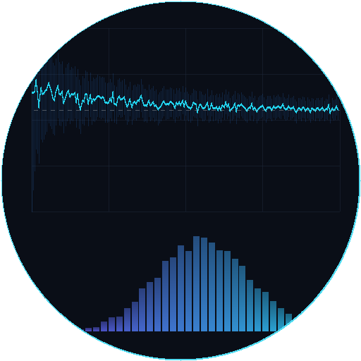

# Multi-Site Monte Carlo Option Pricing

A turnkey demo workflow for [Parallel Works ACTIVATE](https://www.parallel.works/) that prices exotic options using Monte Carlo simulation across two compute sites, with a live dashboard showing payoff histograms and price convergence in real-time.



## Why Monte Carlo for Options Pricing?

An option is a financial contract that gives the holder the right — but not the obligation — to buy or sell an asset at a set price before a certain date. Pricing an option means figuring out what that right is worth today, which requires reasoning about every possible future path the underlying asset's price could take.

For the simplest options (e.g., standard European calls and puts), the Black-Scholes formula provides an exact answer. But most options traded in practice are more complex — their payoff may depend on the average price over time, whether the price ever crosses a barrier, or the behavior of multiple correlated assets. These "exotic" options have no closed-form solution.

**Monte Carlo simulation** solves this by brute force: simulate thousands or millions of possible price paths, compute the payoff for each one, and average the results to get a fair price. It is the industry-standard method for pricing complex derivatives because it handles what closed-form models cannot:

- **Path-dependent options** — Asian options depend on the *average* price over the life of the contract, not just the terminal price. There is no closed-form solution under standard geometric Brownian motion, so simulation is the practical method for pricing them.
- **Barrier options** — Knock-out and knock-in options depend on whether the price *ever* crosses a threshold during the contract. Pricing these requires simulating the full path, not just the endpoint.
- **Flexible modeling** — Monte Carlo naturally accommodates stochastic volatility, jump diffusion, multiple correlated underlyings, and other features that break analytical tractability. Adding complexity to the model means changing the path generator, not deriving a new formula.
- **Risk measurement** — Simulation produces a full distribution of outcomes (as shown in the dashboard's payoff histogram), not just a single price. This enables direct computation of Value-at-Risk, expected shortfall, and other tail-risk metrics that regulators and risk managers require.

The tradeoff is compute: Monte Carlo convergence scales as O(1/√N), meaning 100× more paths are needed for 10× more precision. This makes it a natural fit for parallel and distributed computing — exactly what this workflow demonstrates by splitting paths across multiple sites.

## What It Does

1. **Splits simulation** across two ACTIVATE resources (e.g., an on-prem GPU server + a cloud Slurm cluster)
2. **Runs Monte Carlo paths** in parallel — each site simulates half the total paths using multiprocessing
3. **Streams batch results** via HTTP POST to a live dashboard running on the on-prem resource
4. **Displays results** in real-time through the ACTIVATE session proxy — payoff histogram, price convergence chart, and per-site throughput

## Architecture

```
              ACTIVATE Workflow
                    │
         ┌──────────┴──────────┐
         ▼                      ▼
  Cloud Cluster (Slurm)   On-Prem (SSH)
  simulates paths N/2..N  simulates paths 0..N/2
         │                      │
         └── POST batches ──────┘
                    │
              Dashboard Server
              (on-prem:PORT)
                    │
            ACTIVATE Session Proxy
                    │
              User's Browser
```

## Quick Start

1. Start two ACTIVATE resources:
   - An **on-prem/existing** resource (e.g., `a30gpuserver`) — hosts the dashboard and runs half the simulation
   - A **cloud cluster** (e.g., `googlerockyv3`) — runs the other half of the simulation
2. Run the workflow from the ACTIVATE UI or CLI:
   ```bash
   pw workflows run monte_carlo_pricing
   ```
3. Open the session link to watch the price converge in real-time

## Inputs

| Input | Description | Default |
|-------|-------------|---------|
| On-Prem Resource | Always-on resource for dashboard + simulation | — |
| Cloud Resource | Cloud cluster for the other half of simulation | — |
| Option Type | Exotic option to price (Asian, European, Barrier) | Asian Call |
| Spot Price | Current underlying asset price | 100 |
| Strike Price | Option strike price | 100 |
| Volatility | Annualized volatility (sigma) | 0.2 |
| Risk-Free Rate | Annualized risk-free rate | 0.05 |
| Time to Expiry | Years until expiration | 1.0 |
| Barrier Level | Barrier level (barrier options only) | 150 |
| Monitoring Points | Time steps per path (252 = daily) | 252 |
| Total Simulations | Total MC paths across both sites | 500K |
| Batch Size | Paths per batch (controls update frequency) | 10K |
| Worker Threads | Parallel processes per site | Auto |

## Dashboard Features

- **Price convergence chart** — running MC estimate with narrowing confidence interval
- **Payoff histogram** — terminal payoff distribution across all simulated paths
- **Per-site throughput** — batch completion rate by site, color-coded
- **Live statistics** — elapsed time, paths/sec, current price estimate, standard error
- **Late-join support** — opening the dashboard mid-run shows all completed batches

## File Structure

```
├── workflow.yaml              # ACTIVATE workflow definition
├── thumbnail.png              # Workflow thumbnail
├── README.md                  # This file
└── scripts/
    ├── setup.sh               # Installs Python dependencies on remote hosts
    ├── start_dashboard.sh     # Launches FastAPI dashboard server
    ├── run_simulation.sh      # Runs MC simulation workers and POSTs batches
    ├── setup_tunnel.sh        # Reverse SSH tunnel for cross-site dashboard access
    ├── dashboard.py           # FastAPI + WebSocket live dashboard
    ├── simulator.py           # Monte Carlo option pricing engine
    └── templates/
        └── index.html         # Dashboard UI (charts + live stats)
```

## Requirements

- **Python 3.6+** on both compute resources
- **NumPy** (auto-installed for simulation)
- **FastAPI + Uvicorn + websockets** (auto-installed on the dashboard host)
- No GPU required — pure CPU simulation
